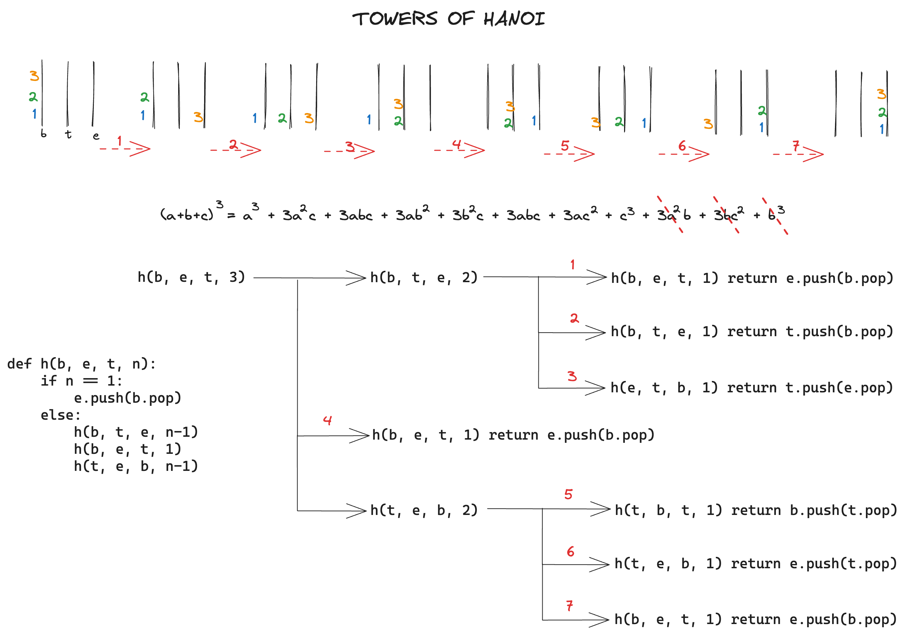
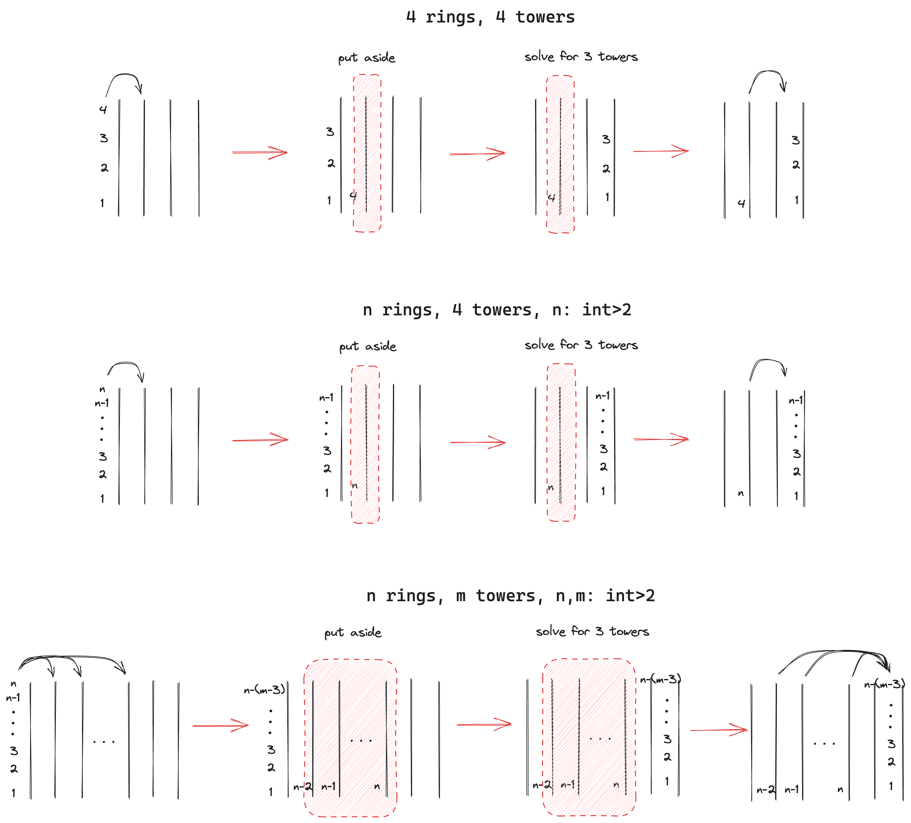

# Towers of Hanoi 

## 1. 3 rings for 3 towers

In the classic problem we have 3 rings and 3 towers. To build the recursion, we list the requisite push and pop movements.

```bash
# move n-1 towers from begin to temp
e.push(b.pop) # distribute
t.push(b.pop) # distribute
t.push(e.pop) # stack

# move base from begin to end
e.push(b.pop)

# move n-1 towers from temp to end
b.push(t.pop) # distribute
e.push(t.pop) # distribute
e.push(b.pop) # stack
 
def hanoi(b, e, t, n):
    if n == 1:
        e.push(b.pop)
    else:
        hanoi(b, t, e, n-1)
        hanoi(b, e, t, 1)
        hanoi(t, e, b, n-1) 

```
Turns out this algorithm works for n rings, as long as there are 3 towers.



## 2. n rings for m towers

We want to solve for a generalized tower of hanoi with n rings and m towers.

For 4 rings and 4 towers, we can repeat trying to stack [2,3,4] on a temporary tower:
```bash
# move n-1 towers from begin to temp 1
e.push(b.pop) # distribute
t2.push(b.pop) # distribute
t1.push(b.pop) # distribute
t1.push(t2.pop) # stack
t1.push(e.pop) # stack

# move base from b to e
e.push(b.pop)

# move n-1 towers from temp 1 to end
b.push(t1.pop) # distribute
t2.push(t1.pop) # distribute
e.push(t1.pop) # distribute
e.push(t2.pop) # stack
e.push(b.pop) # stack

def hanoi_recursion_fn:
    pass 
```

But this can be difficult to see through and build a recursion. 

Instead we build on top of the already existing recursion for 3 towers, by reforming the problem as 3+j = m towers. We fill j towers with single rings from first tower, then set aside those j towers, so the problem becomes a m-j=3 tower problem, for which we can use our existing recursion. 

The number of additional steps of this method compared to 3 towers is linear with j towers. Next steps would be to assess whether a generalized recursion would take less steps.


